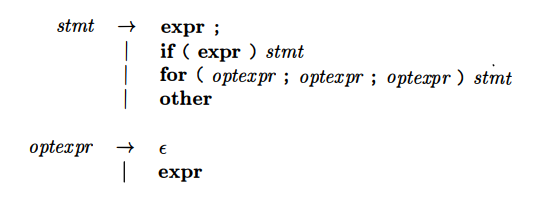

# Annotation


## Chapter 1 Introduction

### 1.8 References for Chapter 1

- [GCC, the GNU Compiler Collection](https://gcc.gnu.org/)
- [*Computer Organization and Design: The Hardware/Software Interface (5th Edition)*](http://ac.aua.am/Arm/Public/2017-Spring-Computer-Organization/Textbooks/ComputerOrganizationAndDesign5thEdition2014.pdf)
- *Programming Language Pragmatics*. Scott, M.

    The 4th edition was published in 2015.

## Chapter 2 A Simple Syntax-Directed Translator

### 2.4 Parsing
#### 2.4.2 Predictive Parsing

*Recursive-descent parsing* is a top-down method of syntax analysis in which a set of recursive procedures is used to process the input. *Predictive parsing* is a form of Recursive-descent parsing, in which the lookahead symbol unambiguously determines the flow of control through the procedure body for each nonterminal.

A grammar for some statements in C and Java:



This grammar could be analysed with predictive parsing:

```
void stmt() {
    switch (lookahead) {
        case EXPR:
            match(EXPR); match(';');
            break;
        case IF:
            match(IF); match('('); match(EXPR); match(')'); stmt();
            break;
        case FOR:
            match(FOR); match('('); optexpr(); match(';'); optexpr(); match(';');
            optexpr(); match(')'); stmt();
            break;
        case OTHER:
            match(OTHER);
            break;
        default:
            report("syntax error");
            break;
    }
}

void optexpr() {
    if (lookahead == EXPR) match(EXPR);
}

void match(terminal t) {
    if (lookahead == t) lookahead = nextTerminal;
    else report("syntax error");
}
```
